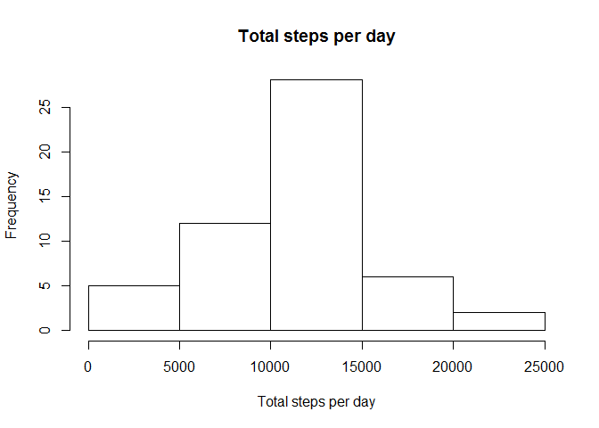
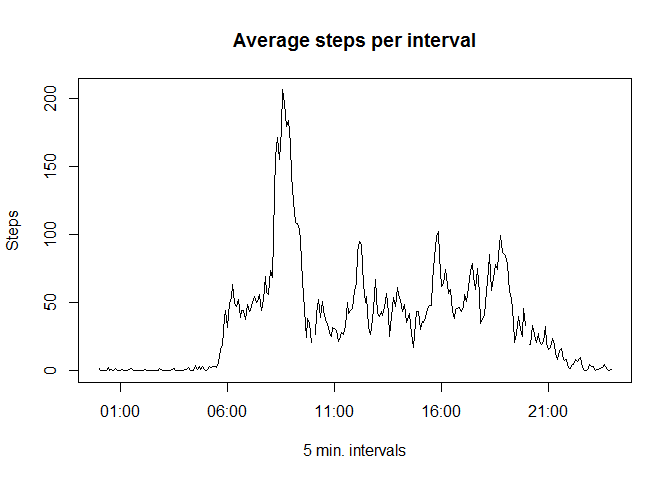
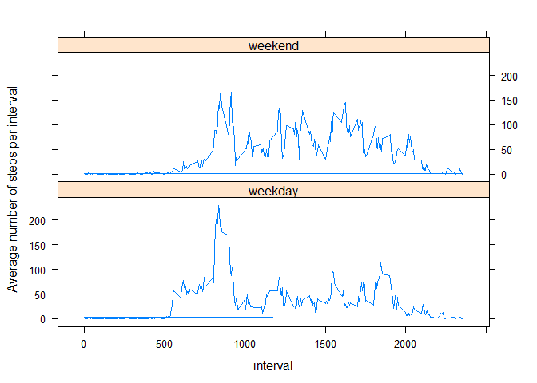

# Reproducible Research: Peer Assessment 1


## Loading and preprocessing the data


```r
ds = read.csv("./activity/activity.csv", sep=",")
```

### What is mean total number of steps taken per day?  
  
#### We must

```r
dsh = aggregate(steps ~ date, data=ds, FUN=sum)
```

#### Histogram of Total number of steps for each day:

```r
hist(dsh$steps, main="Total steps per day", xlab="Total steps per day")
```

<!-- -->
  
#### Mean:

```r
mean(dsh$steps) 
```

```
## [1] 10766.19
```
#### Median:

```r
median(dsh$steps) 
```

```
## [1] 10765
```

## What is the average daily activity pattern?  
#### First we need to know the mean number of steps  
#### of the subjects for each interval  


```r
mspi = aggregate(steps ~  interval, data=ds, FUN=mean)
time = str_pad(mspi$interval*100, 6, pad="0")
time = paste(
          substr(time,1,2), 
          substr(time,3,4), 
          substr(time,5,6), 
          sep=":")
time = as.POSIXct(time, format = "%H:%M:%S")
mspi = mutate(mspi, time=time)
plot(mspi$time, mspi$steps, type="l", xlab="5 min. intervals", ylab="Steps", main="Average steps per interval")
```

<!-- -->
  
    
    
## Imputing missing values
  
#### Number of empty rows:

```r
sum(is.na(ds$steps))
```

```
## [1] 2304
```

#### Missing value will be filled with mean of the interval

```r
## Now we need means for each intervals, without NA values
mspi = aggregate(steps ~ interval, data=ds, FUN=mean, na.rm=TRUE) 
colnames(mspi)[2] = "mspi"

## Let's create a new dataset ds1 from ds with those means
ds1 = inner_join(ds, mspi, by="interval")

## finally, we replace NA values with interval's mean
ds1[is.na(ds$steps),"steps"] = ds1[is.na(ds$steps),"mspi"]
  
sum(is.na(ds1$steps))
```

```
## [1] 0
```

#### Now let's see that histogram again
  


#### Histogram of Total number of steps for each day:

```r
hist(dsh$steps, main="Total steps per day", xlab="Total steps per day")
```

<!-- -->
  
#### Mean:

```r
mean(dsh$steps) 
```

```
## [1] 10766.19
```
#### Median:

```r
median(dsh$steps) 
```

```
## [1] 10766.19
```

#### Hmmm.. Seems like there is no impact !!  
  

## Are there differences in activity patterns between weekdays and weekends?


```r
  ## We must add a factor that will tell us if it's a weekday or a weekend
  ds2 = mutate(ds1[,1:3], dow=ifelse(wday(date) %in% c(1,7),"weekend","weekday"))

  ## Split in two data frames so we can calculate means for each
  we = ds2[ds2$dow=="weekend",]  
  wd = ds2[ds2$dow=="weekday",]
  mspi_we = aggregate(steps ~ interval, we, FUN=mean)
  mspi_wd = aggregate(steps ~ interval, wd, FUN=mean)
  colnames(mspi_we)[2] = "mspi"
  colnames(mspi_wd)[2] = "mspi"
  
  ## Merge each dataset with its respective means resultset
  we = inner_join(we, mspi_we, by="interval")
  wd = inner_join(wd, mspi_wd, by="interval")
  
  ## Now we can combine them back again before we plot them out
  ds2 = rbind(we,wd)
```

#### Shall we see these plots please?

```r
library(lattice)
xyplot(mspi ~ interval | dow, data = ds2, layout=c(1,2), type="l", ylab="Average number of steps per interval")
```

<!-- -->

